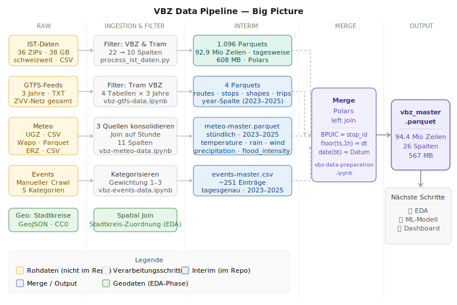

# Zurich Tram Data

**The data engineering foundation behind [`zh-tram-flow`](https://github.com/kaywiegand/zh-tram-flow) — from ~400 Swiss transport operators down to one clean VBZ tram master dataset: 94.4M stop events, 5 sources, fully reproducible.**


---

## TL;DR

- **94,358,531 stop events × 26 columns** — one clean master dataset of every real VBZ tram stop 2023–2025 (one row per stop, not per trip).
- **Five sources merged** — IST real-time traffic, GTFS schedule, weather, event calendar, and geography (district assignment via spatial join).
- **Filtered from ~400 Swiss transport operators down to VBZ tram** — out of 38 GB of compressed IST raw data, every filter decision documented.
- **21 raw IST columns deliberately reduced to 10**, Polars over Pandas as a reasoned tooling choice.
- **Reproducible** across nine numbered notebooks (`00`–`08`).

---

## Where to start

| You are… | Start here |
| :--- | :--- |
| New to the project | [`00_introduction`](notebooks/00_introduction.ipynb) — strategy, data landscape, every filter decision |
| Looking for the pipeline | [`07_master-preparation`](notebooks/07_master-preparation.ipynb) — the join that produces `vbz_master.parquet` |
| Looking for the tooling call | [`01_tooling-evaluation`](notebooks/01_tooling-evaluation.ipynb) — Pandas vs. Polars benchmark |
| Want the short version | [`public/index.html`](public/index.html) — data engineering case landing page |

---

## Table of Contents

- [Project Overview](#project-overview)
- [Objective](#objective)
- [Dataset](#dataset)
- [Approach](#approach)
  - [Research & Feasibility](#research--feasibility)
  - [Ingestion & Filtering](#ingestion--filtering)
  - [Merge](#merge)
  - [Validation](#validation)
- [Notebooks](#notebooks)
- [Tech Stack](#tech-stack)
- [Reports & Artifacts](#reports--artifacts)
- [Setup](#setup)
- [Author](#author)

---

## Project Overview

Public transport is part of everyday life — everyone experiences it, everyone has an opinion on it. That makes it an ideal subject for data work with a tangible, real-world connection. This repository is the **data engineering half** of that story: it builds the clean, enriched dataset that the analysis and prediction work in [`zh-tram-flow`](https://github.com/kaywiegand/zh-tram-flow) depends on.

The choice of Zurich's tram network was deliberate:

- **Relatability** — delays are a lived experience, not an abstract metric.
- **Public good & sustainability** — public transit is a collective resource; better data serves society, not a private interest.
- **Data quality** — Zurich's VBZ publishes granular real-time arrival and departure data for every stop event as Open Government Data. Combined with weather, GTFS schedule, and event data, this is a rare foundation: large enough for real ML, concrete enough for operational insight.

The focus here is deliberately on the **path to the dataset** — research, filtering, merging, quality assurance — not on modelling. Every reduction is documented and justified.

| Phase | Scope | Where |
| :--- | :--- | :--- |
| **Data Engineering** *(this repo)* | Ingest, filter, join, validate 5 sources → master dataset | [`07_master-preparation`](notebooks/07_master-preparation.ipynb) |
| **Data Analysis & Data Science** | 66 findings · LightGBM v2 (MAE 18.56s) · dashboard | [`zh-tram-flow`](https://github.com/kaywiegand/zh-tram-flow) |

---

## Objective

A single, clean master dataset that links the actual VBZ tram stops to schedule, weather, and city events — reproducible end-to-end and transparent in every decision.

The engineering story has two arcs:

**Arc 1 — Reduction.** From the entire Swiss public transport network (every train, bus, cable car, boat) down to VBZ tram in Zurich, 2023–2025. ~11% of rows removed (pass-throughs, extra trips, non-REAL measurements), 21 raw IST columns reduced to 10 — every filter decision documented in [`00_introduction`](notebooks/00_introduction.ipynb).

**Arc 2 — Enrichment.** The filtered IST core is then joined with GTFS schedule (incl. city district via spatial join), hourly weather, and a curated event calendar into `vbz_master.parquet`.

---

## Dataset

**Final dataset:** `data/interim/vbz_master.parquet` — produced by notebooks `00`–`08` in this repo.

| Property | Value |
| :--- | :--- |
| Rows | 94,358,531 (94.4M) |
| Columns | 26 |
| Period | 2023–2025 |
| Granularity | Per stop arrival/departure event (~230 stops per trip on average) |
| Network | VBZ Zurich tram |

**Data sources joined:**

| Layer | Source | Format | Challenge |
| :--- | :--- | :--- | :--- |
| **IST** (real-time traffic) | [archive.opentransportdata.swiss](https://archive.opentransportdata.swiss) | ZIP/CSV | 38 GB compressed, nationwide |
| **GTFS** (schedule) | [data.stadt-zuerich.ch](https://data.stadt-zuerich.ch) | ZIP/TXT | 3 annual versions, full ZVV network |
| **Weather** (meteo) | data.stadt-zuerich.ch (UGZ, Wapo, ERZ) | CSV/Parquet | 3 sources, different resolutions |
| **Events** (calendar) | Manual crawl (Gemini, Perplexity, Transfermarkt) | CSV | No structured source available |
| **Geo** (city districts) | data.stadt-zuerich.ch | GeoJSON | Ready to use |

---

## Approach

The pipeline follows a clear sequence: **research → ingestion → merge → validation → delivery.** Click a diagram to enlarge.

<table>
<tr>
<td valign="top"><a href="public/img/vbz_strategy.svg" target="_blank"> Merge -> vbz_master.parquet" height="440"></a></td>
<td valign="top"><a href="public/img/vbz_preparation.svg" target="_blank"> three joins -> quality checks -> vbz_master.parquet" height="440"></a></td>
</tr>
</table>

### Research & Feasibility

Do the sources exist, in what format and granularity, and can they be meaningfully joined? Zurich's Open Government Data landscape was assessed for coverage and quality before any ingestion. See [`00_introduction`](notebooks/00_introduction.ipynb).

### Ingestion & Filtering

Each source is ingested and filtered down to the relevant scope — the reduction arc. The IST core drops ~11% of rows (pass-throughs, extra trips, non-REAL measurements) and reduces 21 raw columns to 10. Cancellations (`FAELLT_AUS_TF`) are deliberately kept as the most extreme delay case. Notebooks `02`–`06`.

### Merge

The filtered sources are joined into a single master table — the enrichment arc. Three joins (IST × GTFS × Meteo × Events), an hourly key (`floor(1h)`) for weather, and a spatial join for city districts. See [`07_master-preparation`](notebooks/07_master-preparation.ipynb).

### Validation

Eight checks on the master dataset — schema, coverage, value ranges, nulls, and join quality — confirm the result is reproducible and row-for-row identical to the reference dataset. See [`08_master-validation`](notebooks/08_master-validation.ipynb).

---

## Notebooks

In reading order — research → collection → processing → merge → validation:

| Notebook | Purpose |
| :--- | :--- |
| [`00_introduction`](notebooks/00_introduction.ipynb) | Strategy + data landscape · every filter decision |
| [`01_tooling-evaluation`](notebooks/01_tooling-evaluation.ipynb) | Tooling choice: Pandas vs. Polars |
| [`02_ingestion-ist`](notebooks/02_ingestion-ist.ipynb) | IST real-time traffic data (delays) |
| [`03_ingestion-gtfs`](notebooks/03_ingestion-gtfs.ipynb) | GTFS schedule + city district join |
| [`04_ingestion-meteo`](notebooks/04_ingestion-meteo.ipynb) | Weather data (3 sources) |
| [`05_ingestion-events`](notebooks/05_ingestion-events.ipynb) | Event calendar |
| [`06_geo-reference`](notebooks/06_geo-reference.ipynb) | Geo-library benchmark + district assignment |
| [`07_master-preparation`](notebooks/07_master-preparation.ipynb) | Join of all sources → `vbz_master.parquet` |
| [`08_master-validation`](notebooks/08_master-validation.ipynb) | Validation of the master dataset |

---

## Tech Stack

| Category | Tools |
| :--- | :--- |
| Language | Python 3.10 |
| Data (large) | Polars 0.20+ — lazy evaluation, Parquet I/O |
| Data (small) | Pandas |
| Geo | GeoPandas · Shapely (spatial join for city districts) |
| Visualisation | Plotly · Matplotlib |
| Packaging | uv · pyproject.toml |
| Notebooks | JupyterLab |

---

## Reports & Artifacts

| Artifact | What it shows |
| :--- | :--- |
| [Report](public/index.html) | Data engineering case landing — motivation, sources, process diagrams, result |
| [Overview](public/overview.html) | Executive summary of the pipeline |
| [Story View](public/storyview.html) | Narrative perspective — reduction and enrichment as two arcs |
| [Tech View](public/techview.html) | Technical deep-dive — filters, joins, validation |

All HTML artifacts are generated from a single source (`public/md/slides.yaml`) so content can't drift between views. Built via `make portfolio` — full mechanism documented in [wgnd-skills/project-case/build-pipeline.md](https://github.com/kaywiegand/wgnd-skills/blob/main/project-case/build-pipeline.md).

---

## Setup

```bash
git clone https://github.com/kaywiegand/zh-tram-data.git
cd zh-tram-data
uv venv
source .venv/bin/activate          # macOS/Linux · Windows: .venv\Scripts\activate
uv pip install -e ".[da]"          # da = data-analysis deps (Polars, GeoPandas, …)
python -m ipykernel install --user --name zh_tram_data --display-name "Python (zh_tram_data)"
jupyter lab
```

Or simply: `make setup && make kernel`. Then open [`00_introduction`](notebooks/00_introduction.ipynb).

> **Note:** Raw data is not included (`data/` is gitignored — 38 GB compressed IST source, ~1.9 GB interim). The notebooks are the reproducible record of how the master dataset was built.

**Configuration** — central paths live in `src/zh_tram_data/config.py`:

```python
from zh_tram_data.config import PATHS
PATHS["raw"]       # data/raw/
PATHS["interim"]   # data/interim/
PATHS["figures"]   # public/img/
```

**Run tests:**

```bash
pytest
pytest --cov=src/zh_tram_data --cov-report=term-missing
```

---

## Author

**Kay Alexander Wiegand**
Senior Consultant · Data Scientist · Berlin
[LinkedIn](https://de.linkedin.com/in/kaywiegand) · [GitHub](https://github.com/kaywiegand)

*Downstream analysis, modelling, and dashboard in [`zh-tram-flow`](https://github.com/kaywiegand/zh-tram-flow) · scaffolded with [`wgnd-scaffolding`](https://github.com/kaywiegand/wgnd-scaffolding) · built with [`wgnd-toolkit`](https://github.com/kaywiegand/wgnd-toolkit).*
