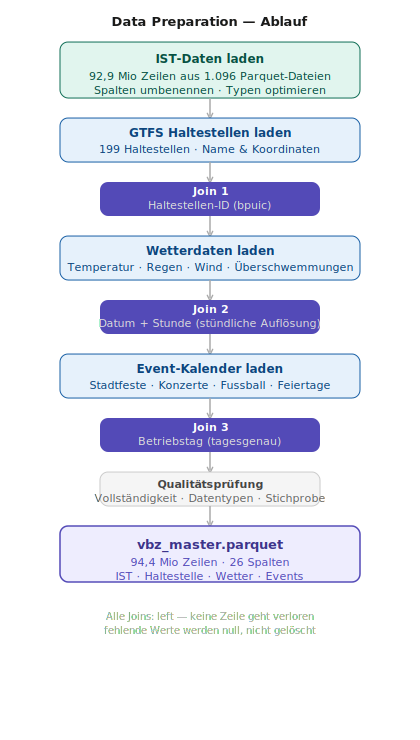

# Zurich Tram Data

> **Typ:** Data Engineering &nbsp;|&nbsp; **Erstellt:** 2026-05-07 &nbsp;|&nbsp; **Version:** 0.1.0

---

## Projekt

Sammlung und Anreicherung von Daten des Zürcher Tram-Netzes der VBZ — die
Data-Engineering-Grundlage für [`zh-tram-flow`](https://github.com/kaywiegand/zh-tram-flow)
(Analyse & Verspätungsvorhersage).

---

## Motivation

Entstanden als Abschlussarbeit einer Data-Science-Fortbildung. Die Ausgangsfrage war
nicht "welches Modell", sondern "welches Thema" — eines, an dem sich Data Science nicht
abstrakt anfühlt, sondern nachvollziehbar an einem Alltagsbeispiel mit echtem Impact: auf
den Alltag, die Lebensqualität, im besten Fall auch auf Nachhaltigkeit.

Die Recherche führte über den ÖPNV nach Zürich: Die Stadt betreibt eine außergewöhnlich
gute Open-Data-Landschaft für ihr Tramnetz (VBZ) — frei zugänglich, gut dokumentiert,
granular genug für echte Analyse. Ein Musterbeispiel dafür, wie Daten sinnstiftend
eingesetzt werden können — nicht als Übung, sondern mit greifbarem Bezug zum Alltag von
Millionen Fahrgästen.

---

## Beschreibung

Ziel ist ein einziger, sauberer Master-Datensatz, der die tatsächlichen Tram-Fahrten der
VBZ mit Fahrplan, Wetter und Stadt-Events verknüpft. Fokus liegt bewusst auf dem Weg
dorthin — Recherche, Filterung, Zusammenführung, Qualitätssicherung — nicht auf
Modellierung. Jede Filter-Entscheidung ist dokumentiert (siehe
`notebooks/00_introduction.ipynb`): warum von ~400 Schweizer Transportunternehmen nur VBZ
Tram übrig bleibt, warum 21 Rohspalten auf 8–10 reduziert wurden, warum Polars statt Pandas.

---

## Datenquellen

| Schicht | Quelle | Format | Herausforderung |
| :--- | :--- | :--- | :--- |
| **IST-Daten** (Verkehr) | archive.opentransportdata.swiss | ZIP/CSV | 38 GB komprimiert, schweizweit |
| **GTFS** (Fahrplan) | data.stadt-zuerich.ch | ZIP/TXT | 3 Jahrgänge, gesamtes ZVV-Netz |
| **Meteo** (Wetter) | data.stadt-zuerich.ch (UGZ, Wapo, ERZ) | CSV/Parquet | 3 Quellen, unterschiedliche Auflösung |
| **Events** (Kalender) | Manueller Crawl (Gemini, Perplexity, Transfermarkt) | CSV | Keine strukturierte Quelle verfügbar |
| **Geo** (Stadtkreise) | data.stadt-zuerich.ch | GeoJSON | Sofort verwendbar |

---

## Process

<table>
<tr>
<td width="50%" valign="top"> Merge -> vbz_master.parquet" width="100%"></td>
<td width="50%" valign="top"> drei Joins -> Qualitätsprüfung -> vbz_master.parquet" width="100%"></td>
</tr>
</table>

---

## Ergebnis

`data/interim/vbz_master.parquet` — **94.358.531 Zeilen × 26 Spalten**: jede reale
VBZ-Tram-Fahrt 2023–2025, angereichert mit Fahrplan (inkl. Stadtkreis via Spatial Join),
Wetter (stündlich) und Event-Kalender. Reproduzierbar über die 9 nummerierten Notebooks
(`00`–`08`), siehe `notebooks/00_introduction.ipynb` für die vollständige Strategie.

Weiterverwendet in [`zh-tram-flow`](https://github.com/kaywiegand/zh-tram-flow) für Analyse,
Modellierung und Dashboard.

---

## Schnellstart

### 1. Virtuelle Umgebung erstellen & aktivieren

```bash
uv venv
source .venv/bin/activate   # Mac/Linux
.venv\Scripts\activate      # Windows
```

### 2. Dependencies + Projektpaket installieren

```bash
uv pip install -e ".[dan]"
```

### 3. Jupyter Kernel registrieren

```bash
python -m ipykernel install --user --name zh_tram_data --display-name "Python (zh_tram_data)"
```

Oder einfach: `make setup && make kernel`

### 4. Los geht's!

Oeffne `notebooks/00_introduction.ipynb` und fange an.

---

## Projektstruktur

```
zh-tram-data/
|
+-- PROCESS_LOG.md          # Projektverlauf & AI-Kontext-Einstieg
+-- ROADMAP.md              # Phasen & offene Tasks
+-- CLAUDE.md               # Claude Code Anweisungen
+-- README.md
+-- pyproject.toml          # Paketkonfiguration & Dependencies
+-- Makefile                # Shortcuts (make setup, make kernel, ...)
+-- .gitignore
|
+-- data/                   # NICHT in Git! (.gitignore)
|   +-- raw/                # Rohdaten - NIEMALS veraendern!
|   +-- interim/            # Zwischenergebnisse
|   +-- processed/          # Finale, analysefertige Daten
|
+-- notebooks/
|   +-- 00_introduction.ipynb       # Strategie + Datenlandschaft
|   +-- 01_tooling-evaluation.ipynb # Pandas vs. Polars
|   +-- 02_ingestion-ist.ipynb      # IST-Verspätungsdaten
|   +-- 03_ingestion-gtfs.ipynb     # GTFS + Stadtkreis-Join
|   +-- 04_ingestion-meteo.ipynb    # Wetterdaten
|   +-- 05_ingestion-events.ipynb   # Event-Kalender
|   +-- 06_geo-reference.ipynb      # Geo-Bibliotheks-Benchmark
|   +-- 07_master-preparation.ipynb # Join -> vbz_master.parquet
|   +-- 08_master-validation.ipynb  # Validierung
|   +-- appendix/                   # Explorationsmaterial (Geo-Map-Varianten)
|
+-- src/zh_tram_data/     # Python-Paket (importierbar nach uv install)
|   +-- config.py           # Zentrale Pfade & Konstanten
|   +-- settings.py         # Plot-Theme, Logging
|   +-- notebook.py         # Zentraler Import-Einstieg fuer Notebooks
|   +-- utils.py            # Hilfsfunktionen
|   +-- data/
|   +-- features/
|   +-- visualization/
|   +-- analytics/
|
+-- tests/
+-- public/
    +-- index.html
    +-- img/
    +-- md/
```

---

## Konfiguration

### Pfade (`src/zh_tram_data/config.py`)

```python
from zh_tram_data.config import PATHS

PATHS["raw"]       # data/raw/
PATHS["processed"] # data/processed/
PATHS["figures"]   # public/img/
```

### Notebook-Einstieg

```python
from zh_tram_data.notebook import *
setup_plotting()
```

---

## Tests ausfuehren

```bash
pytest
pytest --cov=src/zh_tram_data --cov-report=term-missing
```

---

_Generiert mit dem wgnd-scaffolding Generator._
